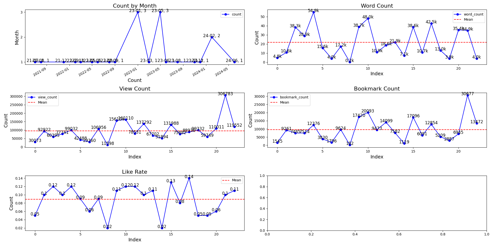

# Pixiv-Down

---

## Overview

Pixiv 爬虫，可下载用户的插画，并提供简单分析功能。

---

## Features

- search and download user info, illust, novel, ~~manga~~
- analyse illust and novel based on publication time, view count, favorites, word count.
- CLI
- ~~UI~~ (developing)

---

## Dependencies

- MySQL

```shell
sudo apt install mysql-server

mysql
```

init database
```mysql
CREATE DATABASE pixiv;
CREATE USER 'skn_p'@'localhost' IDENTIFIED BY "skn";
GRANT ALL PRIVILEGES ON pixiv.* TO 'skn_p'@'localhost';
    
FLUSH PRIVILEGES;
SHOW GRANTS FOR 'skn_p'@'localhost';
```

---

## Install

### use poetry install and run

```shell
poetry install
poetry run pixiv_down --help
```

### use poetry shell(virtual environment)

```shell
poetry install
poetry shell
pixiv_down --help
```

---

## CLI

```shell
python src/pixiv_down.py --help
```

```shell
usage: pixiv_down.py [-h] {config,search,download,scan,analyse,test} ...

positional arguments:
  {config,search,download,scan,analyse,test}
    config              Configure pixiv_api
    search              Search for illust or user
    download            Download work or novel
    scan                scan user illust or novel or manga or all work
    analyse             analyse data
    test                Test pixiv_api

options:
  -h, --help            show this help message and exit
```

### Options

- config 配置文件在 `config/config.json` 文件中;请将`cookie`放到单独文件中, 如`config/cookie`中
- search 搜索用户、插画、小说
- download 下载插画、小说
- scan 扫描用户的插画、小说，存储到数据库
- analyse 分析用户插画的发布时间、点击数、收藏数目；小说的发布时间、点击数、收藏数

#### search

```shell
usage: pixiv_down.py search [-h] [-t {illust,user,novel}] -i I

options:
  -h, --help            show this help message and exit
  -t {illust,user,novel}, --type {illust,user,novel}
                        search by [illust, user, novel]
  -i I                  url or uid
```

#### download

```shell
usage: pixiv_down.py download [-h] [-t {all,illust,novel}] -i I

options:
  -h, --help            show this help message and exit
  -t {all,illust,novel}, --type {all,illust,novel}
                        search by [illust, user, novel]
  -i I                  url or id
```

#### scan

```shell
usage: pixiv_down.py scan [-h] -u UID [-t {illust,novel,manga,all}]

options:
  -h, --help            show this help message and exit
  -u UID, --uid UID     uid
  -t {illust,novel,manga,all}, --type {illust,novel,manga,all}
```

#### analyse

```shell
usage: pixiv_down.py analyse [-h] -u UID [-t {illust,novel,manga,all}]

options:
  -h, --help            show this help message and exit
  -u UID, --uid UID     uid
  -t {illust,novel,manga,all}, --type {illust,novel,manga,all}
```


